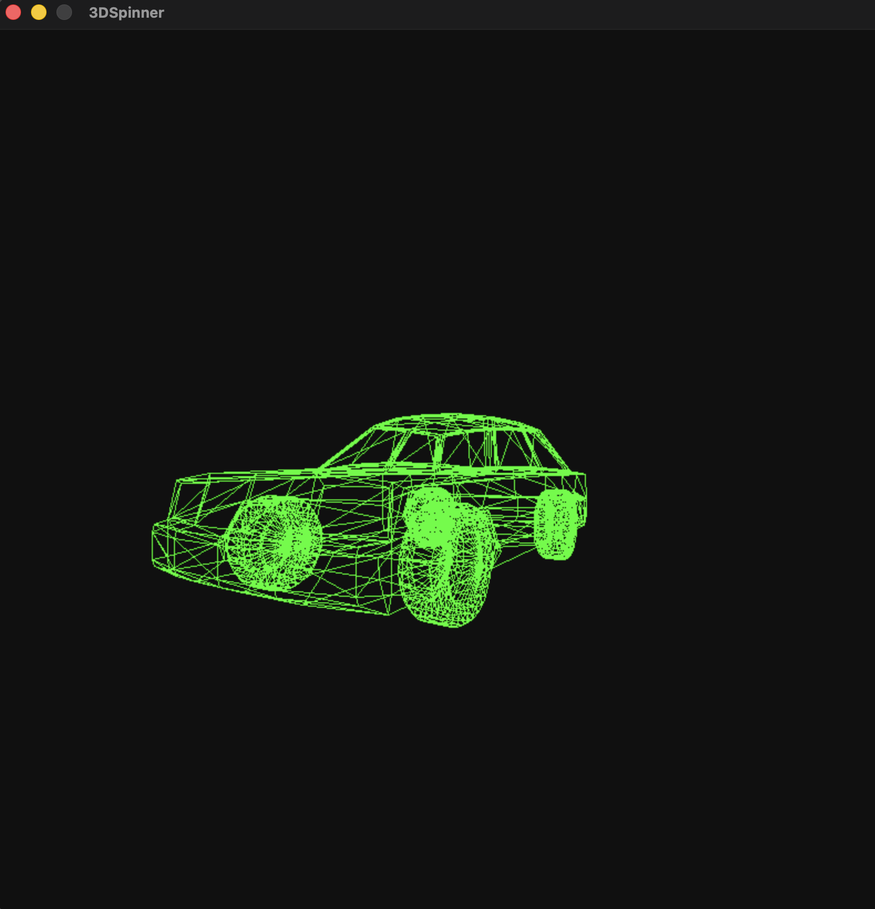
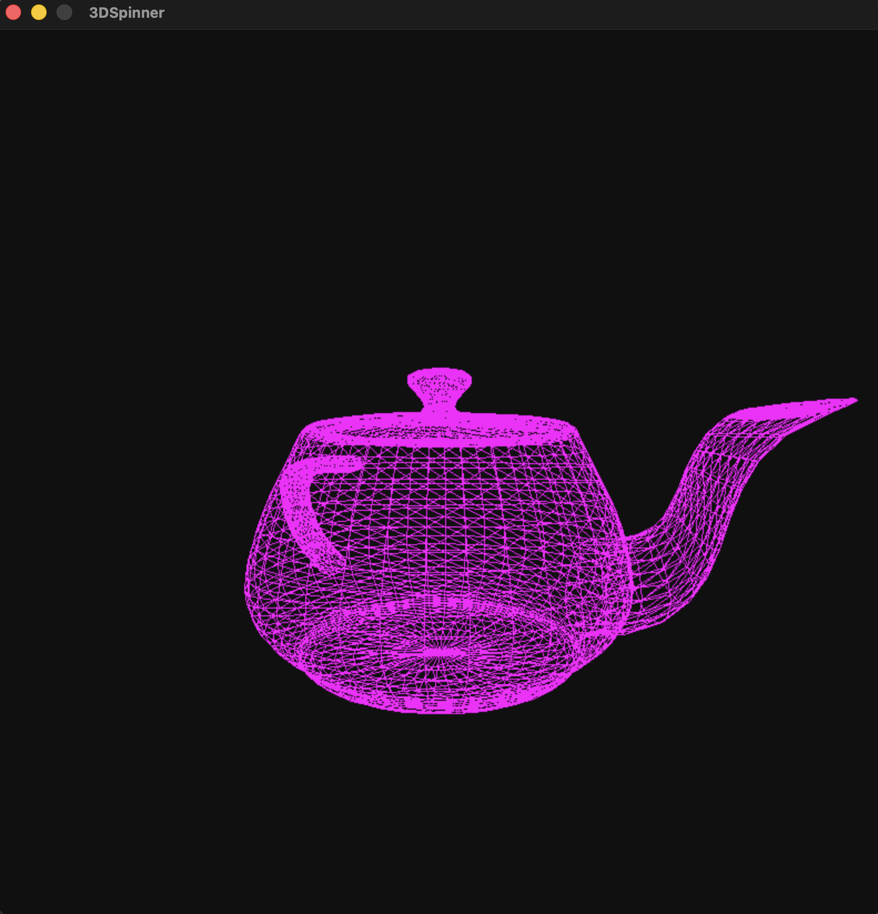

# OBJSpinner
OBJSpinner is a tiny Python/Pygame wireframe viewer that spins OBJ meshes in real time with a simple perspective camera.

    
    

## Highlights
- Loads any OBJ via `-f path.obj` or drag-and-drop; edges extracted with `trimesh`.
- Minimal pinhole perspective projection (perspective divide to NDC: x/z and y/z mapped into [-1, 1]) for the depth effect.
- Auto-rotating Y-axis spin plus adjustable camera offsets for quick fly-arounds.
- Clean wireframe rendering with color cycling and an FPS-capped loop.
- Sample `assets/sample_car.obj` included for an instant preview.

## Controls
- Arrow keys: pan camera (X/Z).
- Space / Left Shift: move camera up/down.
- r: reset camera position.
- c: cycle wireframe color.
- Escape or close window: quit.
- Drop an OBJ file onto the window to load it.

## Run It
- Install Python 3 deps: `pip install pygame trimesh`.
- Start: `python main.py -f assets/sample_car.obj` (flag optional; defaults to the sample).
- Tweak window size and colors in `settings.py`.

## File Structure
- `main.py` — event loop, input handling, spin timer.
- `mesh.py` — OBJ loading, vertices + unique edges.
- `screen.py` — projection math and drawing helpers.
- `point.py` — small 2D/3D point structs.
- `settings.py` — window and color constants.
- `assets/` — sample OBJ for quick testing.

## <3
Inspired by the following video from Tsoding : https://www.youtube.com/watch?v=qjWkNZ0SXfo&t
